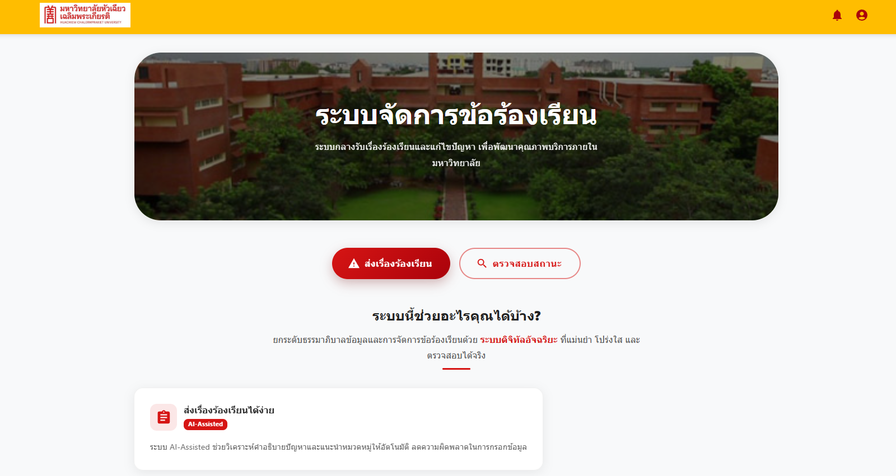
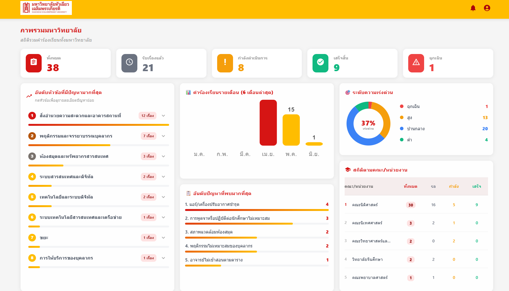
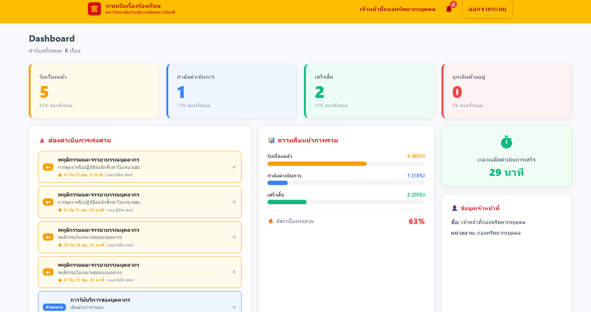
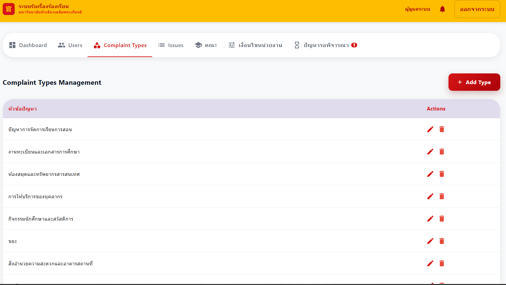

# ระบบจัดการข้อร้องเรียน มฉก.
### HCU Complaint Management System

ระบบรับและจัดการเรื่องร้องเรียนออนไลน์อย่างเป็นทางการของมหาวิทยาลัยหัวเฉียวเฉลิมพระเกียรติ  
พัฒนาด้วย **React + Node.js + Firebase** รองรับ **5 บทบาทผู้ใช้**, AI จัดเส้นทางอัตโนมัติ และ Real-time Notification

---

## Live Demo

| Service  | URL |
|----------|-----|
| Frontend | [report-hcu.vercel.app](https://report-hcu.vercel.app) |
| Backend API | [/api/status](https://report-hcu-api.up.railway.app/api/status) |

> เข้าใช้งานด้วยอีเมล @hcu.ac.th

---

## Screenshots

> ภาพหน้าจอระบบ — เพิ่มได้ใน `docs/screenshots/`

| หน้าหลัก | แดชบอร์ดผู้บริหาร |
|---|---|
|  |  |

| ระบบเจ้าหน้าที่ | ระบบแอดมิน |
|---|---|
|  |  |

---

## Features

### ผู้ใช้ทั่วไป (User / นักศึกษา / บุคลากร)
- แจ้งเรื่องร้องเรียนพร้อมแนบรูปภาพ ระบบ AI แนะนำหัวข้อและปัญหาอัตโนมัติ
- ติดตามสถานะแบบ Real-time พร้อม Activity Log ครบทุกขั้นตอน
- รับการแจ้งเตือนทันทีทุก Event ผ่าน Socket.IO
- ให้คะแนนความพึงพอใจหลังแก้ไขสำเร็จ

### เจ้าหน้าที่ (Officer)
- รับเรื่อง อัปเดตสถานะ และส่งข้อความถึงผู้แจ้งได้โดยตรง
- Dashboard สถิติเฉพาะหน่วยงาน พร้อมรับแจ้งเตือนเรื่องใหม่ทันที
- ส่งรูปภาพหลักฐานประกอบการดำเนินการได้

### เจ้าหน้าที่คณะ / ผู้บริหาร (Faculty / Executive)
- Dashboard วิเคราะห์สถิติเชิงลึก — กราฟรายเดือน, Donut Chart, อันดับหัวข้อ
- รายการคำร้องเรียนแบบค้นหาได้ พร้อม Filter สถานะและดูรายละเอียดแต่ละเรื่อง
- Executive เห็นภาพรวมทั้งมหาวิทยาลัยแยกตามคณะ

### ผู้ดูแลระบบ (Admin)
- CRUD ผู้ใช้ทุกบทบาท รองรับ Bulk Delete และสร้างบัญชีใหม่โดยตรง
- จัดการหน่วยงาน พร้อม Keyword สำหรับ AI Routing
- จัดการหัวข้อปัญหา ประเภทปัญหา และคณะ
- อนุมัติ / ปฏิเสธประเภทปัญหาที่ผู้ใช้แจ้งเพิ่มเข้ามา

---

## Tech Stack

**Frontend**
- React 18, React Router v6
- Material UI v5 (MUI)
- Socket.IO Client v4
- Framer Motion
- Firebase SDK 10 (Authentication)
- Axios

**Backend**
- Node.js, Express.js
- Firebase Admin SDK (Firestore + Auth Token Verification)
- Socket.IO v4
- @xenova/transformers (NLP — multilingual-e5 / MiniLM L6)

**Database & Auth**
- Cloud Firestore (NoSQL)
- Firebase Authentication

**Deployment**
- Vercel — Frontend (SPA rewrite via `vercel.json`)
- Railway — Backend (Health check via `railway.toml`)

---

## Architecture

```
┌──────────────────────────────────────────────┐
│             React 18  (Vercel)               │
│   Firebase Auth SDK        Socket.IO Client  │
│         │                       │            │
└─────────┼───────────────────────┼────────────┘
          │ HTTP + JWT Token       │ WebSocket
          ▼                        ▼
┌──────────────────────────────────────────────┐
│          Express.js API  (Railway)           │
│                                              │
│  ┌──────────────┐  ┌──────────┐  ┌────────┐ │
│  │ Firebase     │  │Socket.IO │  │  NLP   │ │
│  │ Admin SDK    │  │  Server  │  │ Engine │ │
│  │ (Auth+DB)    │  │          │  │(Xenova)│ │
│  └──────┬───────┘  └──────────┘  └────────┘ │
└─────────┼────────────────────────────────────┘
          ▼
┌────────────────────┐
│  Cloud Firestore   │
│  (Firebase NoSQL)  │
└────────────────────┘
```

**Request Flow**
1. React ส่ง Firebase ID Token ใน `Authorization` header ทุก request
2. Express middleware ยืนยัน Token ผ่าน Firebase Admin SDK
3. ตรวจสอบ Role จาก Firestore และ Authorize ตาม RBAC
4. NLP Engine วิเคราะห์ข้อความ แล้ว assign `assignedDepartment` อัตโนมัติ
5. Socket.IO emit event ถึงผู้ใช้และหน่วยงานที่เกี่ยวข้องทันที

---

## Role-Based Access Control (RBAC)

| Role      | สิทธิ์การเข้าถึง |
|-----------|----------------|
| `user`    | แจ้งเรื่อง ติดตามสถานะ ให้คะแนน |
| `officer` | รับเรื่องและอัปเดตสถานะเฉพาะหน่วยงานของตน |
| `faculty` | Dashboard + รายการคำร้องเรียนเฉพาะคณะของตน |
| `executive` | Dashboard ภาพรวมทั้งมหาวิทยาลัย |
| `admin`   | CRUD ทุกส่วน — ผู้ใช้ หน่วยงาน หัวข้อ คณะ |

> Authorization บังคับใช้ทั้ง Frontend (Protected Routes) และ Backend Middleware

---

## AI / NLP Auto-Routing

ระบบใช้ `@xenova/transformers` รัน Inference ฝั่ง Node.js โดยตรง ไม่พึ่ง External API  
โมเดล Multilingual Sentence Embedding คำนวณ **Cosine Similarity** ระหว่างข้อความคำร้องเรียนกับ Keyword ของแต่ละหน่วยงาน แล้วเลือกหน่วยงานที่มีคะแนนสูงสุด พร้อมบันทึก **Routing Memory** (4-gram tokenization) เพื่อปรับปรุงความแม่นยำเมื่อเวลาผ่านไป

---

## Installation

```bash
# 1. Clone repository
git clone https://github.com/ideatrade/report-hcu.git
cd report-hcu

# 2. Setup Backend
cd server
npm install
# วาง serviceAccountKey.json (Firebase Admin) ไว้ใน server/
# สร้าง .env จากตัวอย่างด้านล่าง
npm run dev        # port 5000

# 3. Setup Frontend (terminal ใหม่)
cd client
npm install
npm start          # port 3000
```

**server/.env**
```
PORT=5000
FIREBASE_KEY_PATH=./serviceAccountKey.json
```

**client/.env.local**
```
REACT_APP_API_URL=    # ว่าง = same-origin, หรือใส่ URL Railway สำหรับ Split Deploy
```

> **หมายเหตุ**: `serviceAccountKey.json` ต้องขอจาก Firebase Console  
> และห้าม commit เด็ดขาด (อยู่ใน `.gitignore` แล้ว)

---

## Deploy

**Frontend → Vercel**
```bash
cd client
# ตั้งค่า Environment Variable ใน Vercel Dashboard:
# REACT_APP_API_URL = https://your-railway-url.up.railway.app
vercel --prod
```

**Backend → Railway**
```bash
# Push code ขึ้น GitHub แล้ว Connect Railway กับ repo
# ตั้งค่า Environment Variables ใน Railway:
# PORT, FIREBASE_ADMIN_JSON (Base64 ของ serviceAccountKey.json)
```

---

## What I Learned

- ออกแบบและ implement **Role-Based Access Control 5 ระดับ** ครอบคลุมทั้ง Frontend Route Guard และ Backend Express Middleware
- ใช้ **Firebase Admin SDK** สำหรับ Server-side Token Verification แทน Client SDK เพื่อความปลอดภัยจริง
- Integrate **NLP Model (@xenova/transformers)** ใน Node.js โดยไม่ต้องพึ่ง External API — โมเดลรัน on-device ลด latency และ cost
- สร้าง **Real-time Notification System** ด้วย Socket.IO ครอบคลุมทั้ง Personal Room (userId) และ Role-based Room (`role:officer`)
- แก้ปัญหา **CORS + Split Deploy** สำหรับ Vercel + Railway รวมถึง Same-origin mode สำหรับ Monorepo
- ออกแบบ **Firestore Schema** สำหรับ NoSQL ที่ Query ได้ตาม Role โดยไม่ต้องใช้ Subcollection ที่ซับซ้อน
- จัดการ **Race Condition** ใน Socket.IO เมื่อ Auth state เปลี่ยนในขณะที่ connection ยังคงอยู่

---

## Future Improvements

- [ ] Unit Testing ด้วย Jest + React Testing Library
- [ ] Fine-tune NLP Model สำหรับภาษาไทยโดยเฉพาะ
- [ ] แจ้งเตือนผ่าน Line Notify หรือ Email
- [ ] Export รายงาน PDF / Excel สำหรับผู้บริหาร
- [ ] Progressive Web App (PWA) รองรับ Mobile offline

---

## Project Structure

```
report-hcu/
├── client/                    # React 18 Frontend
│   ├── src/
│   │   ├── pages/
│   │   │   ├── auth/          # Landing, Login, Register
│   │   │   ├── user/          # Dashboard, Report, CheckStatus
│   │   │   ├── officer/       # OfficerSystem
│   │   │   └── admin/         # AdminSystem
│   │   ├── AuthContext.js     # Firebase Auth state
│   │   ├── SocketContext.js   # Socket.IO context
│   │   └── api.js             # Axios instance + interceptors
│   └── vercel.json            # SPA rewrite config
│
└── server/                    # Express.js Backend
    ├── routes/
    │   ├── complaints.js      # CRUD + status update
    │   ├── admin.js           # Users, depts, types management
    │   └── departments.js     # Public dept listing
    ├── utils/
    │   ├── embedder.js        # NLP model wrapper
    │   ├── departmentRouter.js# Semantic routing logic
    │   ├── routingMemory.js   # 4-gram routing cache
    │   └── notificationHelper.js
    ├── config/firebase.js     # Admin SDK init
    ├── server.js              # Entry point
    └── railway.toml           # Railway deploy config
```

---

## Author

พัฒนาโดย **ideatrade**  
[GitHub](https://github.com/ideatrade)

---

*© 2568 ระบบจัดการข้อร้องเรียน มหาวิทยาลัยหัวเฉียวเฉลิมพระเกียรติ*
