# เอกสารการออกแบบและสถาปัตยกรรมระบบ (System Design & Architecture)

เอกสารฉบับนี้รวบรวมแผนภาพการออกแบบและสถาปัตยกรรมสำหรับระบบรับเรื่องร้องเรียน โดยครอบคลุมตั้งแต่ภาพรวมของสถาปัตยกรรม, Use Case, Sequence, Activity, Class Diagram และ Data Dictionary เพื่อให้เห็นภาพรวมการทำงานและความสัมพันธ์ของส่วนประกอบต่างๆ ในระบบ

---

## 1. สถาปัตยกรรมระบบ (System Architecture)

ระบบถูกออกแบบตามสถาปัตยกรรม Client-Server โดยมีส่วนประกอบหลักดังนี้:

- **Client (Frontend)**: พัฒนาด้วย React.js ทำหน้าที่เป็นส่วนติดต่อผู้ใช้ (User Interface) สำหรับผู้ใช้งานทุกระดับ (นักศึกษา, เจ้าหน้าที่, ผู้ดูแลระบบ) และสื่อสารกับ Backend ผ่าน RESTful API
- **Server (Backend)**: พัฒนาด้วย Node.js และ Express.js ทำหน้าที่จัดการ Logic ของระบบทั้งหมด เช่น การประมวลผล NLP, การจัดการข้อมูล, การยืนยันตัวตน และการกำหนดสิทธิ์การเข้าถึง
- **Database**: ใช้ Google Firestore ซึ่งเป็น NoSQL Database สำหรับจัดเก็บข้อมูลทั้งหมดของระบบ เช่น ข้อมูลผู้ใช้, ข้อมูลเรื่องร้องเรียน, และข้อมูลประเภทปัญหา
- **Firebase Services**:
    - **Firebase Authentication**: ใช้สำหรับจัดการการยืนยันตัวตนของผู้ใช้ (Login/Register)
    - **Cloud Firestore**: เป็นฐานข้อมูลหลักของระบบ
- **NLP Service**: ใช้โมเดลภาษาจาก `@xenova/transformers` ที่ทำงานบนฝั่ง Server เพื่อประมวลผลและวิเคราะห์ข้อความจากเรื่องร้องเรียน

### แผนภาพสถาปัตยกรรม (Architecture Diagram)

```mermaid
graph TD
    subgraph "ผู้ใช้งาน (Users)"
        A[นักศึกษา (Student)]
        B[เจ้าหน้าที่ (Officer)]
        C[ผู้ดูแลระบบ (Admin)]
    end

    subgraph "Client (React App)"
        D[เว็บแอปพลิเคชัน]
    end

    subgraph "Server (Node.js/Express)"
        E[RESTful API Gateway]
        F[Authentication Middleware]
        G[NLP Processing Service]
        H[Complaint Management Logic]
        I[User & Role Management]
    end

    subgraph "Google Cloud Platform"
        J[Firebase Authentication]
        K[Cloud Firestore Database]
    end

    A & B & C -->|เข้าใช้งานผ่าน Browser| D
    D <-->|HTTPS (REST API Calls)| E

    E --> F
    E --> G
    E --> H
    E --> I

    F -->|Verify Token| J
    H & I & G -->|CRUD Operations| K
```

---

## 2. Use Case Diagram

แผนภาพนี้แสดงถึงปฏิสัมพันธ์ระหว่างผู้ใช้งาน (Actors) กับฟังก์ชันต่างๆ ของระบบ (Use Cases)

### Actors:
- **นักศึกษา (Student)**: นักศึกษาหรือบุคลากรมหาวิทยาลัยที่ยื่นเรื่องร้องเรียน
- **เจ้าหน้าที่ (Officer)**: ผู้รับผิดชอบในการดำเนินการแก้ไขเรื่องร้องเรียน
- **ผู้ดูแลระบบ (Admin)**: ผู้จัดการระบบโดยรวม

### แผนภาพ Use Case

```mermaid
graph TD
    subgraph "ระบบรับเรื่องร้องเรียน"
        direction LR

        subgraph "จัดการบัญชี"
            uc1("เข้าสู่ระบบ (Login)")
            uc2("ลงทะเบียน (Register)")
        end

        subgraph "จัดการเรื่องร้องเรียน"
            uc3("ยื่นเรื่องร้องเรียน")
            uc4("ตรวจสอบสถานะเรื่องร้องเรียน")
            uc5("ดูประวัติเรื่องร้องเรียน")
            uc6("รับและดูรายละเอียดเรื่องร้องเรียน")
            uc7("อัปเดตสถานะและบันทึกการดำเนินการ")
            uc8("ส่งต่อเรื่องร้องเรียน")
        end

        subgraph "การจัดการระบบ"
            uc9("จัดการผู้ใช้งานและบทบาท")
            uc10("จัดการหน่วยงาน/แผนก")
            uc11("ดูภาพรวมและสถิติ")
        end
    end

    actorCitizen("นักศึกษา")
    actorOfficer("เจ้าหน้าที่")
    actorAdmin("ผู้ดูแลระบบ")

    actorCitizen --|> uc1
    actorCitizen --|> uc2
    actorCitizen --|> uc3
    actorCitizen --|> uc4
    actorCitizen --|> uc5

    actorOfficer --|> uc1
    actorOfficer --|> uc6
    actorOfficer --|> uc7
    actorOfficer --|> uc8

    actorAdmin --|> uc1
    actorAdmin --|> uc9
    actorAdmin --|> uc10
    actorAdmin --|> uc11
    actorAdmin --|> uc6
```

---

## 3. Sequence Diagram

แผนภาพนี้แสดงลำดับการทำงานและการสื่อสารระหว่างส่วนประกอบต่างๆ ของระบบในแต่ละ Use Case ที่สำคัญ

### 3.1 การยื่นเรื่องร้องเรียน (Submit Complaint)

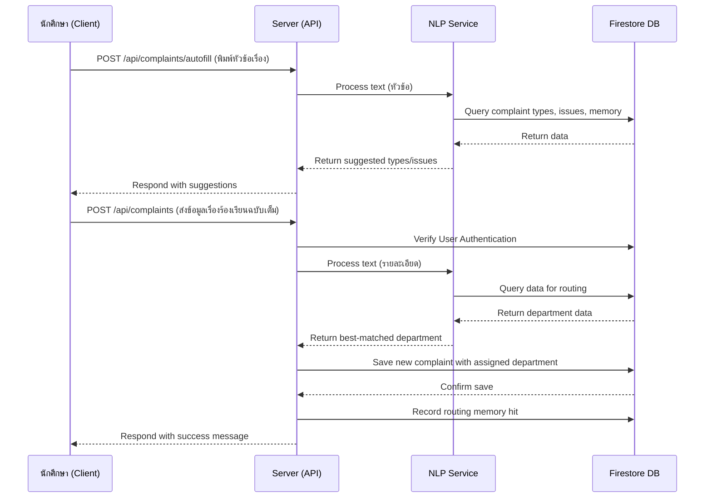

### 3.2 เจ้าหน้าที่จัดการเรื่องร้องเรียน (Officer Processes Complaint)

แผนภาพนี้แสดงลำดับการทำงานของเจ้าหน้าที่ตั้งแต่การดูรายการเรื่องร้องเรียน, การตรวจสอบรายละเอียด ไปจนถึงการอัปเดตสถานะ โดยมี Interface ทำหน้าที่เป็นตัวกลางระหว่างผู้ใช้และ Server

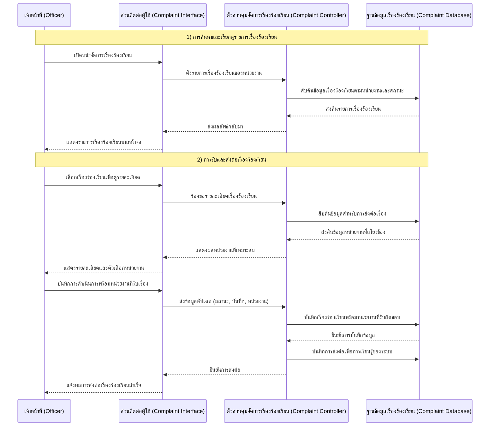

### 3.3 กระบวนการวิเคราะห์และส่งต่อเรื่องร้องเรียนอัตโนมัติด้วย NLP (Automated NLP Routing)

แผนภาพนี้แสดงลำดับการทำงานภายในระบบเมื่อได้รับเรื่องร้องเรียนใหม่ โดยเน้นกระบวนการประมวลผลภาษาธรรมชาติ (Natural Language Processing) และการตัดสินใจเลือกหน่วยงานที่เหมาะสมที่สุดโดยอัตโนมัติ ซึ่งเป็นกลไกหลักที่แยกระบบนี้ออกจากระบบรับเรื่องร้องเรียนทั่วไป

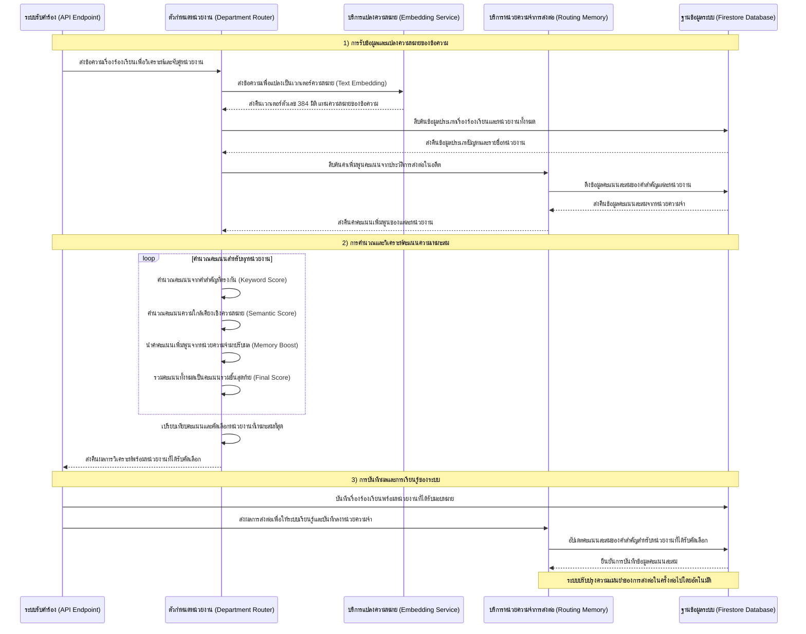

### 3.4 ผู้ดูแลระบบจัดการข้อมูลในระบบ (Admin Manages System)

แผนภาพนี้แสดงลำดับการทำงานของผู้ดูแลระบบในสองกระบวนการหลัก ได้แก่ การจัดการข้อมูลคณะและสาขาวิชาของผู้ใช้งาน และการกำหนดเงื่อนไขคำสำคัญของแต่ละหน่วยงาน ซึ่งเงื่อนไขเหล่านี้ถูกนำไปใช้โดยตรงในกระบวนการวิเคราะห์และส่งต่อเรื่องร้องเรียนอัตโนมัติ (NLP Routing)

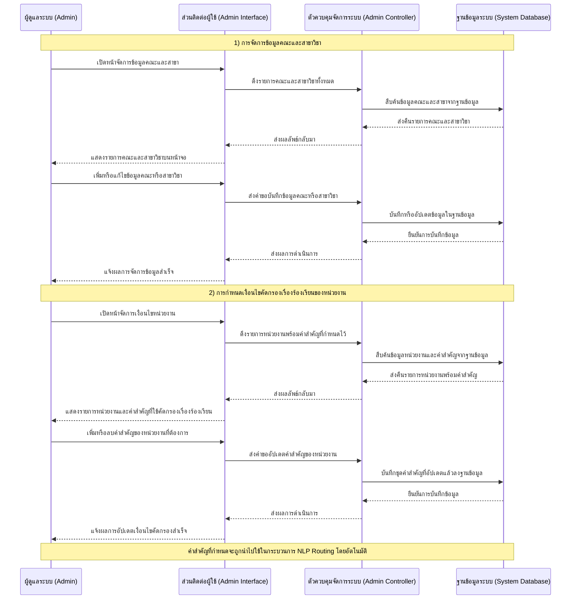

---

## 4. Activity Diagram

แผนภาพนี้แสดงขั้นตอนการทำงาน (Workflow) ของกิจกรรมหลักในระบบ

### 4.1 กิจกรรมการยื่นเรื่องร้องเรียน (Student)

```mermaid
graph TD
    A[เริ่ม] --> B{ผู้ใช้มีบัญชี?};
    B -->|ไม่มี| C[ไปหน้าลงทะเบียน];
    C --> D[กรอกข้อมูลส่วนตัว];
    D --> E[สร้างบัญชีผู้ใช้];
    B -->|มี| F[ไปหน้าเข้าสู่ระบบ];
    F --> G[กรอก Email/Password];
    G --> H{ข้อมูลถูกต้อง?};
    H -->|ไม่ถูกต้อง| G;
    H -->|ถูกต้อง| I[เข้าสู่ระบบสำเร็จ];
    E --> I;

    I --> J[ไปหน้ายื่นเรื่องร้องเรียน];
    J --> K[กรอกหัวข้อและรายละเอียด];
    K --> L{ระบบแนะนำประเภท/ปัญหา};
    L --> M[ผู้ใช้เลือกประเภท/ปัญหา];
    M --> N[แนบไฟล์ (ถ้ามี)];
    N --> O[กดยืนยันการส่ง];
    O --> P[ระบบประมวลผลและบันทึกข้อมูล];
    P --> Q[แสดงหมายเลขติดตามเรื่อง];
    Q --> R[สิ้นสุด];
```

### 4.2 กิจกรรมการจัดการเรื่องร้องเรียน (Officer)

```mermaid
graph TD
    A[เริ่ม] --> B[เจ้าหน้าที่เข้าสู่ระบบ];
    B --> C[เปิดหน้า Dashboard];
    C --> D[แสดงรายการเรื่องร้องเรียนที่ได้รับมอบหมาย];
    D --> E{เลือกเรื่องร้องเรียน?};
    E -->|ใช่| F[ดูรายละเอียดเรื่องร้องเรียน];
    F --> G{ต้องการดำเนินการ?};
    G -->|ใช่| H[อัปเดตสถานะ (เช่น 'กำลังดำเนินการ')];
    H --> I[เพิ่มบันทึกการดำเนินการ];
    I --> J[บันทึกข้อมูล];
    J --> D;
    G -->|ไม่| D;
    E -->|ไม่| K[สิ้นสุด];
```

---

### 4.3 การออกแบบส่วนติดต่อกับผู้ใช้งาน (User Interface Design)

การออกแบบส่วนติดต่อผู้ใช้งาน (User Interface Design) ของระบบรับเรื่องร้องเรียนฉบับนี้ดำเนินการตามแนวทางของ **Material Design** โดยนำไลบรารี **MUI (Material-UI v5)** มาประยุกต์ใช้เพื่อรับประกันความสม่ำเสมอของส่วนประกอบภาพ (Component Consistency) และประสบการณ์การใช้งานที่เป็นมาตรฐานเดียวกันตลอดทั้งระบบ ทั้งนี้ได้คำนึงถึงหลักการออกแบบที่รองรับการแสดงผลบนอุปกรณ์ที่มีขนาดหน้าจอแตกต่างกัน (Responsive Design) อีกด้วย ระบบแบ่งหน้าจอออกเป็น 4 กลุ่มตามบทบาทการใช้งาน ได้แก่ **หน้าสาธารณะ (Public Pages)** สำหรับผู้ใช้ที่ยังไม่ได้เข้าสู่ระบบ **หน้านักศึกษา (Student Pages)** **หน้าเจ้าหน้าที่ (Officer Pages)** และ **หน้าผู้ดูแลระบบ (Admin Pages)** ตามลำดับ

#### โครงสร้างการนำทางของระบบ (Navigation Architecture)

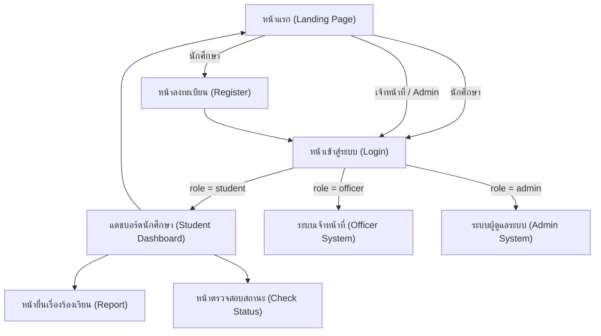

---

#### 4.3.1 หน้าแรก (Landing Page)

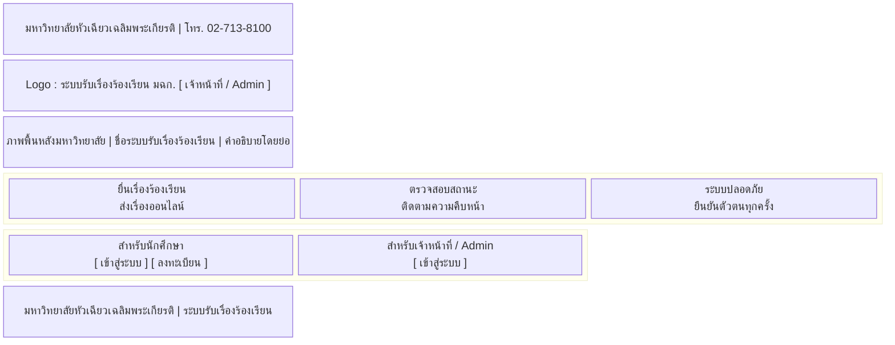

**รูปที่ 4.3.1** แสดงแบบจำลองเค้าโครงหน้าจอ (Wireframe) ของหน้าแรก (Landing Page) ซึ่งทำหน้าที่เป็นจุดเข้าถึงหลักของระบบ (Entry Point) สำหรับผู้ใช้งานทุกกลุ่ม การออกแบบประกอบด้วยองค์ประกอบลำดับชั้นจากบนลงล่างดังนี้ (1) **แถบข้อมูลองค์กร (Top Information Bar)** แสดงชื่อหน่วยงานและช่องทางการติดต่อ (2) **แถบนำทางหลัก (AppBar)** แสดงอัตลักษณ์ระบบและปุ่มสำหรับเจ้าหน้าที่ (3) **ส่วนนำเสนอระบบ (Hero Section)** นำเสนอจุดมุ่งหมายและขอบเขตการใช้งาน (4) **การ์ดคุณสมบัติ (Feature Cards)** อธิบายความสามารถหลักของระบบในรูปแบบ 3 คอลัมน์ตามหลักการจัดวางแบบ Grid Layout และ (5) **ส่วนการเข้าถึงระบบ (Access Section)** แยกกลุ่มผู้ใช้งานออกเป็นนักศึกษาและเจ้าหน้าที่อย่างชัดเจน เพื่อนำผู้ใช้ไปยังกระบวนการยืนยันตัวตนที่เหมาะสมกับบทบาท

---

#### 4.3.2 หน้าเข้าสู่ระบบ (Login Page)

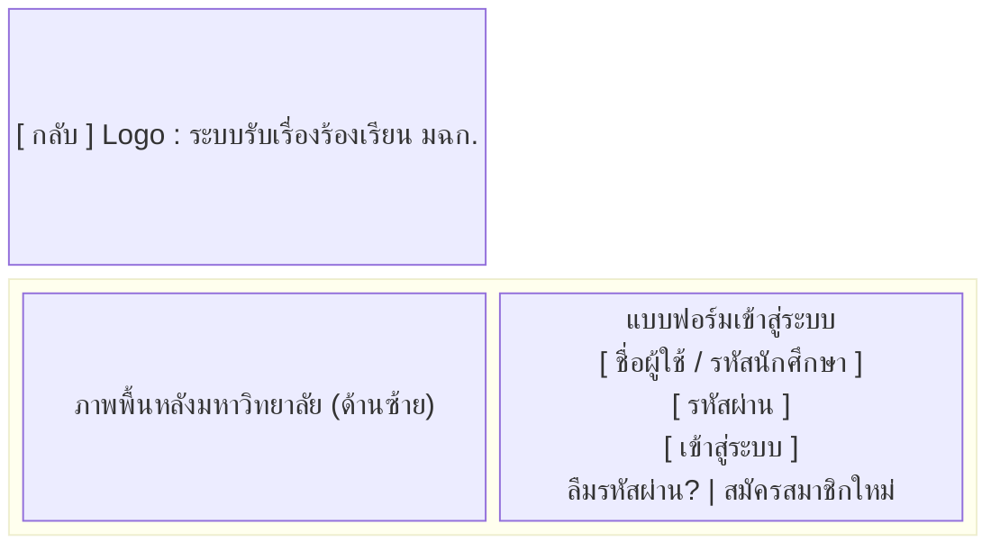

**รูปที่ 4.3.2** แสดงแบบจำลองเค้าโครงหน้าจอของหน้าเข้าสู่ระบบ (Login Page) ซึ่งออกแบบตามรูปแบบเลย์เอาต์ 2 คอลัมน์ (Two-Column Layout) โดยคอลัมน์ด้านซ้ายแสดงภาพประกอบของมหาวิทยาลัยเพื่อเสริมสร้างอัตลักษณ์องค์กรและความน่าเชื่อถือของระบบ ส่วนคอลัมน์ด้านขวาประกอบด้วยแบบฟอร์มยืนยันตัวตนที่มีช่องกรอกข้อมูล 2 รายการ ได้แก่ **ชื่อผู้ใช้หรือรหัสนักศึกษา** ซึ่งระบบจะแปลงค่าดังกล่าวเป็นรูปแบบอีเมล `@hcu.ac.th` โดยอัตโนมัติก่อนส่งไปยังบริการยืนยันตัวตน และ **รหัสผ่าน** รวมถึงมีช่องทางสำหรับขอรีเซ็ตรหัสผ่านและลิงก์ไปยังหน้าลงทะเบียน หน้าจอนี้ถูกใช้ร่วมกันสำหรับทุกกลุ่มผู้ใช้ โดยระบบจะกำหนดสิทธิ์การเข้าถึง (Access Control) ตามค่า `role` ที่บันทึกไว้ในฐานข้อมูลภายหลังการยืนยันตัวตนสำเร็จ

---

#### 4.3.3 หน้าลงทะเบียน (Register Page)

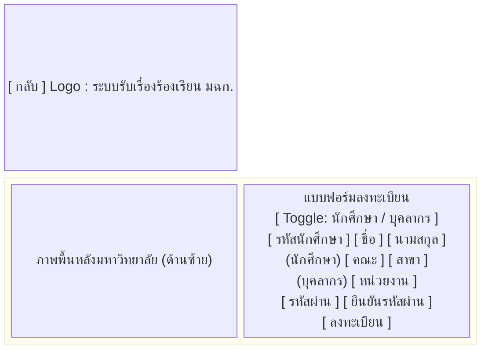

**รูปที่ 4.3.3** แสดงแบบจำลองเค้าโครงหน้าจอของหน้าลงทะเบียน (Register Page) ซึ่งใช้โครงสร้างเลย์เอาต์ 2 คอลัมน์เช่นเดียวกับหน้าเข้าสู่ระบบเพื่อรักษาความสม่ำเสมอของอินเทอร์เฟซ แบบฟอร์มถูกออกแบบให้แสดงผลแบบมีเงื่อนไข (Conditional Rendering) ผ่านกลไก **Toggle Button** โดยแบ่งออกเป็น 2 โหมด ได้แก่ (1) **โหมดนักศึกษา** รับข้อมูลรหัสนักศึกษา ชื่อ-นามสกุล คณะ และสาขาวิชา โดยรายการสาขาวิชาจะเปลี่ยนแปลงโดยอัตโนมัติตามคณะที่เลือก (Cascading Dropdown) และ (2) **โหมดบุคลากร** รับข้อมูลรหัสบุคลากรและหน่วยงานต้นสังกัด รายการคณะและหน่วยงานโหลดแบบพลวัต (Dynamic Loading) จาก API เพื่อให้ข้อมูลอ้างอิงมีความถูกต้องและทันสมัยอยู่เสมอ การออกแบบดังกล่าวช่วยให้ระบบสามารถจัดเก็บข้อมูลสังกัดของผู้ใช้ได้อย่างถูกต้องและนำไปใช้ในกระบวนการคัดกรองเรื่องร้องเรียนตามคณะได้อย่างมีประสิทธิภาพ

---

#### 4.3.4 หน้าแดชบอร์ดนักศึกษา (Student Dashboard)

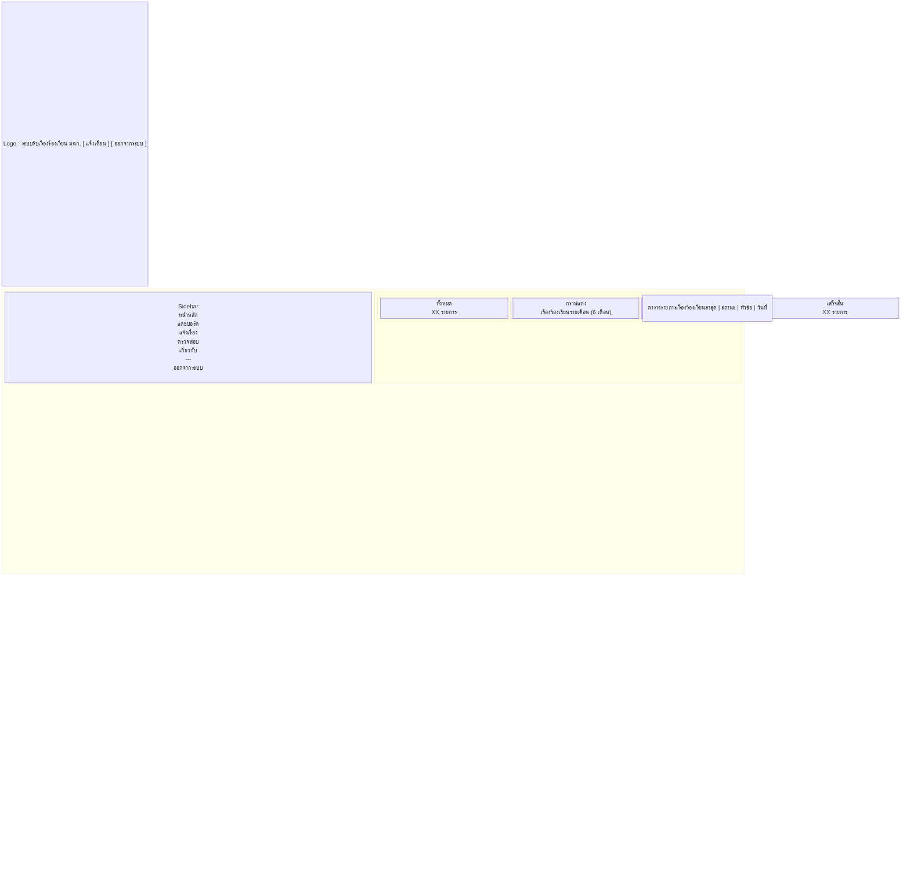

**รูปที่ 4.3.4** แสดงแบบจำลองเค้าโครงหน้าจอของแดชบอร์ดนักศึกษา (Student Dashboard) ซึ่งออกแบบตามรูปแบบ Sidebar Navigation Layout โดย **แถบนำทางด้านข้าง (Sidebar)** ทำหน้าที่เป็นองค์ประกอบนำทางหลักที่แสดงอยู่ตลอดเวลา ส่วนพื้นที่เนื้อหาหลัก (Main Content Area) ประกอบด้วย (1) **การ์ดสรุปสถิติ** จำนวน 4 ใบ แสดงจำนวนเรื่องร้องเรียนแยกตามสถานะ ได้แก่ รอดำเนินการ กำลังดำเนินการ และเสร็จสิ้น (2) **กราฟแสดงแนวโน้ม** ย้อนหลัง 6 เดือน เพื่อให้ผู้ใช้เห็นภาพรวมการยื่นเรื่อง (3) **ตารางจัดอันดับประเภทปัญหา** ที่พบบ่อย และ (4) **ตารางรายการเรื่องร้องเรียนล่าสุด** ทั้งนี้ มุมมองของข้อมูลจะแตกต่างกันตามบทบาท (`role`) ของผู้ใช้งาน กล่าวคือ ผู้ใช้ระดับ `student` จะเห็นเฉพาะข้อมูลของตนเอง ในขณะที่ระดับ `faculty` และ `executive` จะเห็นข้อมูลในภาพรวมระดับคณะหรือมหาวิทยาลัยตามลำดับ

---

#### 4.3.5 หน้ายื่นเรื่องร้องเรียน (Report Page)

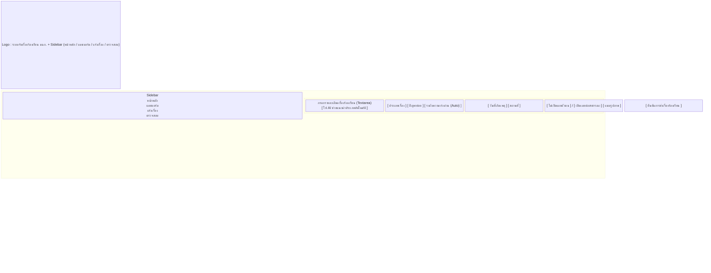

**รูปที่ 4.3.5** แสดงแบบจำลองเค้าโครงหน้าจอของหน้ายื่นเรื่องร้องเรียน (Report Page) ซึ่งเป็นหน้าจอหลักสำหรับการปฏิสัมพันธ์ของนักศึกษากับระบบ จุดเด่นสำคัญของหน้าจอนี้คือการบูรณาการ **ระบบแนะนำประเภทปัญหาอัตโนมัติ (AI-Assisted Autofill)** โดยเมื่อผู้ใช้กรอกรายละเอียดและกดปุ่มขอรับคำแนะนำ ระบบจะส่งข้อความดังกล่าวไปประมวลผลด้วยโมดูล NLP และส่งคืนข้อเสนอแนะสำหรับ **ประเภทเรื่อง** และ **ปัญหาย่อย** ที่เหมาะสมที่สุด ซึ่งผู้ใช้สามารถยืนยันหรือแก้ไขได้ตามดุลยพินิจ นอกจากนี้ ระบบยังกำหนด **ระดับความเร่งด่วน** โดยอัตโนมัติตามประเภทปัญหาที่เลือก พร้อมทั้งมีตัวเลือกด้านความเป็นส่วนตัว (ไม่เปิดเผยตัวตน หรือ เปิดเผยต่อสาธารณะ) และฟังก์ชันการแนบรูปภาพหลักฐานประกอบเรื่องร้องเรียน

---

#### 4.3.6 หน้าตรวจสอบสถานะ (Check Status Page)

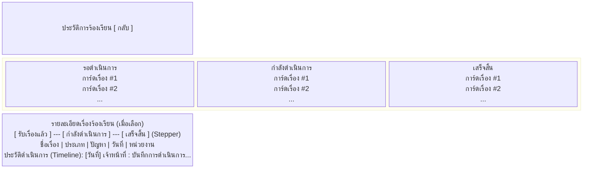

**รูปที่ 4.3.6** แสดงแบบจำลองเค้าโครงหน้าจอของหน้าตรวจสอบสถานะเรื่องร้องเรียน (Check Status Page) ซึ่งถูกออกแบบให้รองรับการแสดงผล 2 มุมมองที่สลับกันตามการกระทำของผู้ใช้ ได้แก่ (1) **มุมมองรายการ (List View)** จัดกลุ่มเรื่องร้องเรียนทั้งหมดของผู้ใช้ออกเป็น 3 หมวดหมู่ตามสถานะ พร้อมกลไก Pagination ที่กำหนดให้แสดงผล 4 รายการต่อหน้า เพื่อควบคุมปริมาณข้อมูลที่แสดงในแต่ละครั้ง และ (2) **มุมมองรายละเอียด (Detail View)** ซึ่งเปิดใช้งานเมื่อผู้ใช้เลือกรายการเรื่องร้องเรียน ประกอบด้วย **แผนภาพแสดงขั้นตอนความคืบหน้า (Stepper Progress Bar)** 3 ระดับ ข้อมูลเรื่องร้องเรียนฉบับสมบูรณ์ และ **ลำดับเวลาการดำเนินการ (Action Timeline)** ที่แสดงบันทึกการดำเนินงานของเจ้าหน้าที่ในแต่ละขั้นตอนตามลำดับเวลา

---

#### 4.3.7 หน้าระบบจัดการสำหรับเจ้าหน้าที่ (Officer System)

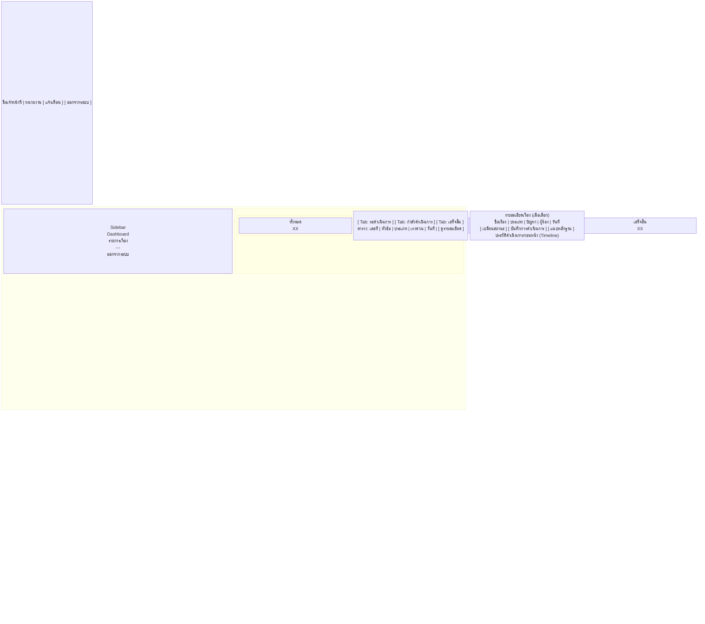

**รูปที่ 4.3.7** แสดงแบบจำลองเค้าโครงหน้าจอของระบบจัดการเรื่องร้องเรียนสำหรับเจ้าหน้าที่ (Officer System) ซึ่งออกแบบตามรูปแบบ Sidebar Navigation Layout ร่วมกับองค์ประกอบ **ระบบแจ้งเตือนแบบทันที (Real-time Notification Bell)** เพื่อให้เจ้าหน้าที่รับทราบเรื่องร้องเรียนใหม่ได้โดยไม่ต้องโหลดหน้าใหม่ ส่วนพื้นที่เนื้อหาหลักแบ่งออกเป็น 2 โหมดการทำงาน ได้แก่ (1) **โหมดภาพรวม (Dashboard Mode)** แสดงการ์ดสรุปสถิติและตารางรายการเรื่องร้องเรียนจัดกลุ่มตาม Tab สถานะ และ (2) **โหมดจัดการรายการ (Management Mode)** ซึ่งเปิดใช้งานเมื่อเลือกเรื่องร้องเรียน แสดงข้อมูลฉบับสมบูรณ์พร้อมส่วนดำเนินการ (Action Panel) ที่รวม การเปลี่ยนสถานะ การบันทึกข้อความรายงาน และการแนบภาพหลักฐานไว้ในหน้าเดียวกัน ทั้งนี้ ระบบกรองข้อมูลให้แสดงเฉพาะเรื่องร้องเรียนที่ถูกส่งต่อมายังหน่วยงานของเจ้าหน้าที่ผู้ใช้งานนั้น ๆ เท่านั้น

---

#### 4.3.8 หน้าระบบจัดการสำหรับผู้ดูแลระบบ (Admin System)

```mermaid
block-beta
  columns 1
  ATopBar["Logo : ระบบจัดการผู้ดูแลระบบ                               [ แจ้งเตือน ]  [ ออกจากระบบ ]"]
  ATabs["แถบ Tabs: [ Dashboard ] [ ผู้ใช้งาน ] [ ประเภทปัญหา ] [ ปัญหาย่อย ] [ คณะ/สาขา ] [ เงื่อนไขหน่วยงาน ] [ คำขอรอพิจารณา ]"]
  block:acontent:1
    ADash["Tab Dashboard  :  สถิติรวม — ผู้ใช้งาน / เจ้าหน้าที่ / ผู้ดูแล / เรื่องร้องเรียน"]
    AUsers["Tab ผู้ใช้งาน  :  [ ค้นหา ]  [ กรอง Role ]\nตาราง: uid  |  ชื่อ  |  บทบาท  |  คณะ  |  สาขา  |  [ แก้ไข ]  [ ลบ ]"]
    ATypes["Tab ประเภทปัญหา / ปัญหาย่อย  :  ตารางรายการ + เพิ่ม / แก้ไข / ลบ"]
    AFaculty["Tab คณะและสาขาวิชา  :  ตาราง: ชื่อคณะ  |  รายการสาขา  |  [ เพิ่ม ]  [ แก้ไข ]"]
    ARouting["Tab เงื่อนไขหน่วยงาน  :  ตาราง: ชื่อหน่วยงาน  |  คำสำคัญ (Keywords)  |  [ เพิ่ม ]  [ ลบ ]"]
    APending["Tab คำขอรอพิจารณา  :  รายการคำขอเพิ่มประเภทปัญหาใหม่  |  [ อนุมัติ ]  [ ปฏิเสธ ]"]
  end
```

**รูปที่ 4.3.8** แสดงแบบจำลองเค้าโครงหน้าจอของระบบจัดการสำหรับผู้ดูแลระบบ (Admin System) ซึ่งออกแบบด้วยรูปแบบ Tab Navigation เพื่อรวบรวมเครื่องมือการจัดการทั้งหมดไว้บนหน้าจอเดียวกัน ประกอบด้วย 7 แท็บการทำงาน ได้แก่ (1) **Dashboard** แสดงสถิติภาพรวมของระบบทั้งหมด (2) **ผู้ใช้งาน** สำหรับจัดการข้อมูลบัญชี บทบาท และสังกัดของผู้ใช้ (3) **ประเภทปัญหา/ปัญหาย่อย** สำหรับกำหนดและบริหารจัดการตัวเลือกในแบบฟอร์มร้องเรียน (4) **คณะและสาขาวิชา** สำหรับบริหารข้อมูลอ้างอิงที่ใช้ในกระบวนการลงทะเบียน (5) **เงื่อนไขหน่วยงาน** สำหรับกำหนดคำสำคัญ (Keywords) ของแต่ละหน่วยงานเพื่อใช้ในกระบวนการ NLP Routing ซึ่งเป็นแท็บที่มีความสัมพันธ์โดยตรงกับระบบปัญญาประดิษฐ์ และ (6) **คำขอรอพิจารณา** สำหรับอนุมัติหรือปฏิเสธคำขอเพิ่มประเภทปัญหาใหม่จากผู้ใช้งาน การออกแบบในลักษณะนี้ช่วยให้ผู้ดูแลระบบสามารถเข้าถึงฟังก์ชันทั้งหมดได้จากที่เดียวโดยไม่ต้องเปลี่ยนหน้าจอ

---

## 5. Class Diagram

This diagram presents the **Domain Model** of the system following the UML standard. It illustrates the structure of conceptual entities, their relationships, and their behaviors. The system applies the **Role-Based Access Control (RBAC)** principle, separating users by role through Inheritance relationships. All class attributes and methods are derived directly from the Data Dictionary.

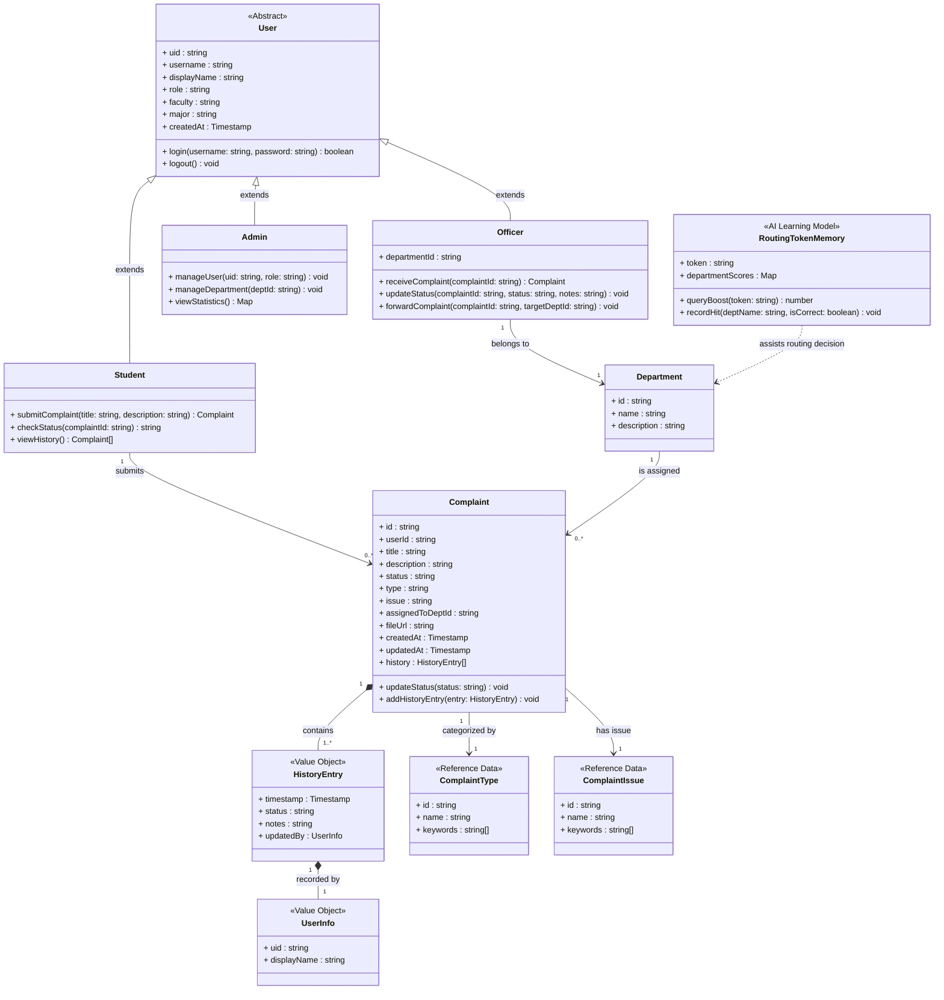

---

## 6. Data Dictionary

ตารางข้อมูลนี้อธิบายรายละเอียดของแต่ละฟิลด์ใน Collections หลักของ Firestore

### Collection: `users`
เก็บข้อมูลผู้ใช้งานในระบบ

| ลำดับ | Field          | Type        | คีย์ | คำอธิบาย                                              | ตัวอย่าง                            |
|-------|----------------|-------------|------|-------------------------------------------------------|-------------------------------------|
| 1     | `uid`          | `string`    | PK   | Unique ID จาก Firebase Authentication (Document ID)   | `uAbCdeFgHiJkLmNoPqRsT`             |
| 2     | `username`     | `string`    |      | รหัสนักศึกษาหรือรหัสพนักงานที่ใช้เข้าสู่ระบบ          | `650954`                            |
| 3     | `displayName`  | `string`    |      | ชื่อ-นามสกุลที่แสดงในระบบ                              | `อภิรมณ์ พุ่มพวง`                   |
| 4     | `role`         | `string`    |      | บทบาทของผู้ใช้ (`student`, `officer`, `admin`)         | `student`                           |
| 5     | `faculty`      | `string`    |      | คณะที่สังกัด (สำหรับผู้ใช้ทั่วไป)                      | `คณะวิศวกรรมศาสตร์`                 |
| 6     | `major`        | `string`    |      | สาขาวิชาที่สังกัด (สำหรับผู้ใช้ทั่วไป)                 | `วิศวกรรมคอมพิวเตอร์`               |
| 7     | `departmentId` | `string`    |      | ID ของหน่วยงานที่สังกัด (สำหรับ `officer` เท่านั้น)    | `dept-engineering`                  |
| 8     | `createdAt`    | `Timestamp` |      | วันเวลาที่สร้างบัญชีในระบบ                              | `May 5, 2026 at 10:00 AM`           |

### Collection: `complaints`
เก็บข้อมูลเรื่องร้องเรียนทั้งหมด

| Field            | Type        | Description                                         | Example                                |
|------------------|-------------|-----------------------------------------------------|----------------------------------------|
| `id`             | `string`    | Auto-generated ID ของเรื่องร้องเรียน (Document ID)  | `cmp-XyZ123AbC`                        |
| `userId`         | `string`    | `uid` ของผู้ที่ยื่นเรื่องร้องเรียน                  | `uAbCdeFgHiJkLmNoPqRsT`                |
| `title`          | `string`    | หัวข้อเรื่องร้องเรียน                                | `ปัญหาท่อระบายน้ำอุดตัน`                |
| `description`    | `string`    | รายละเอียดของเรื่องร้องเรียน                        | `ท่อระบายน้ำหน้าบ้านเลขที่ 123 อุดตัน...` |
| `status`         | `string`    | สถานะปัจจุบัน (`pending`, `in-progress`, `resolved`, `closed`, `rejected`) | `in-progress` |
| `type`           | `string`    | ประเภทเรื่องร้องเรียนที่ผู้ใช้เลือก                 | `สาธารณูปโภค`                          |
| `issue`          | `string`    | ปัญหาย่อยที่ผู้ใช้เลือก                             | `ท่อระบายน้ำ`                           |
| `assignedToDeptId`| `string`    | ID ของแผนกที่ได้รับมอบหมายให้ดูแลเรื่องนี้         | `dept-public-works`                    |
| `fileUrl`        | `string`    | URL ของไฟล์ที่แนบมา (ถ้ามี)                         | `https://.../complaint.jpg`            |
| `createdAt`      | `Timestamp` | วันเวลาที่ยื่นเรื่องร้องเรียน                       | `May 5, 2026 at 11:30:00 AM UTC+7`     |
| `updatedAt`      | `Timestamp` | วันเวลาที่มีการอัปเดตล่าสุด                         | `May 6, 2026 at 09:00:00 AM UTC+7`     |
| `history`        | `Array<Map>`| ประวัติการดำเนินการของเรื่องร้องเรียน แต่ละรายการประกอบด้วย `timestamp`, `status`, `notes`, และ `updatedBy` ซึ่งเป็น Object ที่เก็บ `uid` และ `displayName` ของเจ้าหน้าที่ผู้ดำเนินการ | `[{ status: 'in-progress', notes: 'รับเรื่องแล้ว', updatedBy: { uid: 'abc', displayName: 'สมชาย' } }]` |

### Collection: `departments`
เก็บข้อมูลหน่วยงานหรือแผนกต่างๆ

| Field         | Type     | Description                               | Example               |
|---------------|----------|-------------------------------------------|-----------------------|
| `id`          | `string` | ID ของหน่วยงาน (Document ID)              | `dept-public-works`   |
| `name`        | `string` | ชื่อหน่วยงาน                              | `ฝ่ายโยธาธิการ`       |
| `description` | `string` | คำอธิบายหน้าที่ของหน่วยงาน                | `ดูแลเรื่องถนน, ท่อ...`|

### Collection: `routingTokenMemory`
เก็บข้อมูลคะแนนของคำ (Token) สำหรับช่วยในการส่งต่อเรื่องร้องเรียนอัตโนมัติ

| Field             | Type     | Description                                       | Example                               |
|-------------------|----------|---------------------------------------------------|---------------------------------------|
| `token`           | `string` | คำสำคัญ (Token) ที่ได้จากเรื่องร้องเรียน (Document ID) | `ท่อ`                                 |
| `departmentScores`| `Map`    | Object ที่เก็บคะแนนของแต่ละแผนกสำหรับ Token นี้   | `{ "ฝ่ายโยธา": { score: 5, count: 10 } }` |

---
เอกสารฉบับสมบูรณ์
